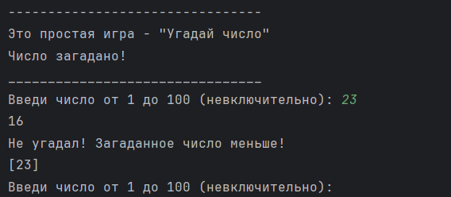

## Текстовая игра "Угадай число!"

### Краткая суть проекта

Программа генерирует случайное число, а игрок должен
угадать это число, получая подсказки о том, больше
или меньше загаданное число введенного значения.

Также вся информация о введеных числах сохранятеся
в словарь:
(ключи — «больше» и «меньше», значение — список чисел)

### Особенности кода



>На данном скриншоте число '16'
> является загаданным числом.
> 
> Оно выводится для удобства тестрирования программы
> и для первоначального понимания того, как
> работает программа.
> 
> Число '23' является элементом списка, в который сохраняются
> все введенные числа пользователем.

После того как первоначально ознакомились с программой
можно убрать вывод этих значений, чтобы полноценно насладиться игрой!

**Чтобы убрать вывод этих значений нужно убрать следующие
строчки кода:**

```python
print(computer_number)

print(list_more_numbers)

print(list_less_numbers)
```

### Что нужно сделать, чтобы протестировать данную игру?

1. Зайти на _GitHub_ и скачать следующие файлы: `main.py`, `README.md`
2. Запустить файл `main.py` через программу PyCharm
3. Пользоваться игрой 

### Окружение
1. Операционная система: Windows 10 Pro
2. Версия PyCharm: PyCharm 2023.3.2


